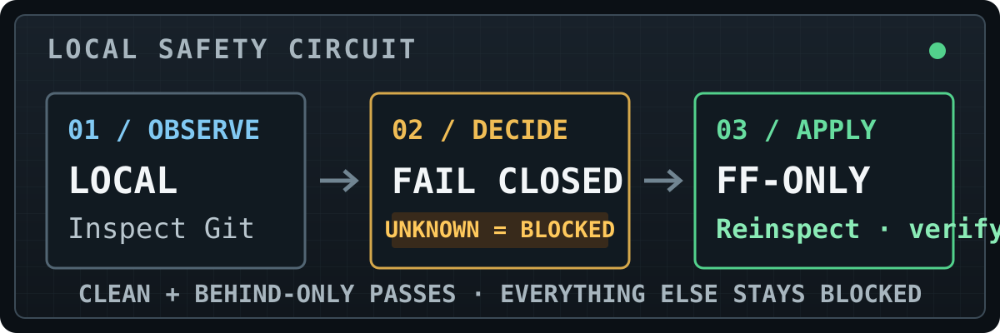

<div align="center">

# VersionDrift

**Know which Git repositories are safe to advance—and which must not be touched.**

Local-only observation. Fail-closed decisions. One deliberately narrow working-tree update: a verified `git pull --ff-only` for clean, behind-only repositories.

[](https://github.com/seojoonkim/version-drift/releases)
[](https://pypi.org/project/version-drift/)
[](https://pypi.org/project/version-drift/)
[](https://github.com/seojoonkim/version-drift/actions/workflows/ci.yml)
[](LICENSE)



</div>

## Install

Requires **Python 3.9+** and Git on `PATH`.

```bash
uv tool install version-drift
# or
pipx install version-drift
```

VersionDrift runs locally, sends **no telemetry**, and does not upload repository paths, remotes, or results.

## The gate, in one minute

VersionDrift is a **local-only** gate that discovers repositories only below roots you provide. It inspects local Git facts, classifies drift, and keeps dirty, ambiguous, unsupported, or unknown states behind the gate. It is **not** a general multi-repository command runner.

```bash
# 1. Save roots (validates configuration; does not scan)
version-drift init ~/code ~/work

# 2. Observe
version-drift scan
version-drift inbox --fetch

# 3. Preview decisions (observation only)
version-drift sync ~/code --plan

# 4. Explicitly apply eligible fast-forwards
version-drift sync ~/code --apply
```

> **A `sync --plan` result is observation, never authorization.** Plan evidence may be stale immediately. Apply fetches according to its own flags, takes a per-repository local lock, independently reinspects immediately before pulling, and verifies the result afterward.

Without `--fetch`, `scan`, `inbox`, and `inspect` compare existing local remote-tracking refs. `sync` fetches by default; choose explicitly with `--fetch` or disable it with `--no-fetch`.

## Safety contract

### What it does

- **Observes:** bounded discovery under explicit/resolved roots; inspection of HEAD, upstream, relation, worktree, and required Git metadata.
- **Blocks by default:** unknown or unreadable facts never become permission.
- **Allows one case:** an attached, ordinary checkout that tracks an upstream, has a clean worktree, and is behind-only.
- **Applies one operation:** exactly `git pull --ff-only`, after an immediate independent reinspection.
- **Verifies:** pull success is not reported as applied until post-pull inspection confirms synchronized state.
- **Records locally:** decision and lifecycle events support inbox, history, and diagnosis.

### What it never does

- reset, stash, or clean;
- merge or rebase;
- push or force operations;
- guess an upstream;
- execute arbitrary user-supplied Git commands;
- treat a scan, dry run, plan, or lock as authorization.

Apply is blocked for dirty, ahead, diverged, missing-upstream, detached, in-progress, shallow, linked-worktree, submodule, and unreadable/unknown states. This includes submodule checkouts and repositories containing tracked submodule metadata. If the head, upstream, worktree fingerprint, eligibility, or required metadata changes before apply, the repository stays blocked.

## Command map

All commands support the global `--base-dir DIR`; machine-readable commands offer `--json`.

- **`init` — save default roots, without scanning**
  ```bash
  version-drift init ~/code ~/work [--json]
  ```
  Root precedence later is command-line roots, saved configuration, `VERSION_DRIFT_ROOTS`, then the current directory.

- **`scan` — bounded read-only checkup**
  ```bash
  version-drift scan ~/code ~/work [--fetch] [--check] [--json]
  version-drift scan ~/code --max-depth 3
  ```
  `--check` exits 1 when drift is present. `--root` is a repeatable compatibility alias.

- **`inbox` — changes since the previous snapshot**
  ```bash
  version-drift inbox [~/code] [--fetch] [--json]
  ```
  Reports states that are new, changed, or resolved. Snapshots are replaced atomically; corruption is preserved and fails closed rather than silently replacing the baseline.

- **`history` — newest-first local decision trail**
  ```bash
  version-drift history
  version-drift history ~/code/project --event scan --limit 20 --json
  ```
  Read-only: never invokes Git, records events, updates snapshots, or creates missing state directories. Malformed JSONL lines are counted and skipped; an unreadable event file fails without modification.

- **`inspect` — inspect one repository**
  ```bash
  version-drift inspect ~/code/project [--fetch] [--json]
  ```

- **`explain` — reasons and safe next actions**
  ```bash
  version-drift explain ~/code/project [--json]
  ```
  Does not fetch, change Git state, record an event, or update the inbox snapshot.

- **`sync` — plan, preview, or apply the narrow gate**
  ```bash
  version-drift sync ~/code --plan [--fetch | --no-fetch] [--json]
  version-drift sync ~/code               # dry-run preview
  version-drift sync ~/code --apply [--fetch | --no-fetch] [--json]
  ```
  Plan and dry run never update working files or local branches. Unless `--no-fetch` is supplied, they may refresh remote-tracking refs and tags; they also record local VersionDrift events. Apply uses a per-repository local lock, reinspects, runs only `git pull --ff-only` for eligible repositories, then verifies. Locks reduce duplicate local concurrency; they are not authorization.

- **`doctor` — read-only runtime and state diagnostics**
  ```bash
  version-drift doctor [--json]
  ```
  Checks Python, Git, configuration, events, inbox snapshot, apply locks, and state-directory access. It reports issues but does not create, repair, truncate, or delete state. See the [operations guide](docs/OPERATIONS.md).

`scan`, `inbox`, `explain`, and `sync` also accept `--max-depth N` where applicable; the default discovery depth is 5.

## Agent integration board (shipped MVP)

The integration board is a local coordination and observation surface for agents. Give every repository a stable, explicit `--repository-id`; use the same value for add, list, and board. No network access or fetch is required.

```bash
# Record an immutable request, pinning both refs to their current full commit OIDs.
version-drift integrate intent add ~/code/project \
  --repository-id project-1 --intent-id api-change --agent-id agent-api \
  --source refs/heads/agent/api --target refs/heads/main \
  --summary "Add the API endpoint"

# A dependent request; --depends-on is repeatable.
version-drift integrate intent add ~/code/project \
  --repository-id project-1 --intent-id ui-change --agent-id agent-ui \
  --source refs/heads/agent/ui --target refs/heads/main \
  --summary "Use the endpoint" --depends-on api-change

version-drift integrate intent list ~/code/project --repository-id project-1
version-drift integrate board ~/code/project \
  --repository-id project-1 --target refs/heads/main --json
```

`intent add` resolves source and target locally and writes only VersionDrift's external local intent state; an existing intent ID is never overwritten. `intent list` and `board` are strictly read-only: no branches are merged, no conflicts are resolved, and no Git refs, worktrees, or indexes are changed. The board reports a deterministic dependency order and stable reason codes. A ref moving away from its pinned OID makes an intent `STALE`; an unobservable ref or malformed store is `UNKNOWN`, and **UNKNOWN = BLOCKED** for policy purposes.

Board exit codes are exact: `0` for `READY`, `1` for `BLOCKED` or `STALE`, `2` for CLI/repository/ref validation errors, and `3` for `UNKNOWN` (including malformed state). Intent/list operational failures follow the general exit-code contract below.

This shipped MVP does **not** perform merge-tree analysis, propose or apply integrations, resolve conflicts, acquire leases, create sandboxes/worktrees, or invoke an LLM. Those are future ideas, not current capabilities.

---

## Machine-readable contract

### Frozen v1 schemas

The VersionDrift 1.x safety/report core freezes these schema identifiers and established fields:

- inspection and event report: `version-drift/1`
- scan envelope: `version-drift/scan/1`
- sync envelope: `version-drift/sync/1`
- plan envelope: `version-drift/plan/1`
- doctor envelope: `version-drift/doctor/1`

Other command contracts are `version-drift/config/1`, `version-drift/inbox/1`, `version-drift/explain/1`, `version-drift/history/1`, `version-drift/integration-intent/1`, and `version-drift/integration-board/1`.

Legacy report fields are retained. Additive, orthogonal fields and new fail-closed reason/event values may appear in 1.x; consumers must ignore unknown fields and tolerate values that follow existing safety semantics. Fields are not removed, moved, renamed without retaining the legacy field, or given incompatible meaning during 1.x. Semantic breaks—including weaker apply checks—require a new major version and migration guidance. See the exact [VersionDrift 1.x compatibility contract](COMPATIBILITY.md).

### Outcomes

Scan, sync, and plan envelopes report:

- `complete` — required observations/operations completed; repositories may still be policy-blocked.
- `partial` — some observations/operations failed while others completed; for sync, at least one apply was verified.
- `failed` — required observations/operations failed with no verified applicable success, as defined by the command.

Outcome is separate from repository relation and eligibility. **Never infer authorization from `complete`.**

### Exit codes

- `0` — command completed under its command-specific policy.
- `1` — a reported non-operational condition or command failure, including `scan --check` drift, an unhealthy doctor, unsuccessful inspection, failed plan observation, or a single-repository sync policy block.
- `2` — command-line usage or validation error, including argparse errors.
- `3` — scan or sync operational `partial` or `failed`, including an uninspectable explicit scope, pull failure, or unverified pull outcome.

JSON consumers should use envelope `outcome` and per-repository reasons as well as the intentionally compressed process exit code.

## State and privacy

Default state locations:

```text
macOS: ~/Library/Application Support/VersionDrift/events.jsonl
Linux: ${XDG_STATE_HOME:-~/.local/state}/version-drift/events.jsonl
```

`inbox_snapshot.json` and `locks/` live beside `events.jsonl`. Configuration lives at:

```text
macOS: ~/Library/Application Support/VersionDrift/config.toml
Linux: ${XDG_CONFIG_HOME:-~/.config}/version-drift/config.toml
```

`--base-dir` and `VERSION_DRIFT_DIR` select an explicit state root; for compatibility, explicit roots use `.version-drift/` beneath that root.

State can contain local paths, remote URLs, branches, and Git status facts. Treat it as private operational data, exclude it from public logs, and put no secrets in configuration. Event history is append-only during normal recording, but it is diagnostic—not tamper-evident. For recovery, held locks, and `outcome_unknown`, follow [docs/OPERATIONS.md](docs/OPERATIONS.md).

## Boundaries and compatibility

VersionDrift is a local safety tool, **not a security boundary**, authorization system, sandbox, malware defense, transaction manager, or complete defense against data loss. It trusts the local OS, Python runtime, selected Git executable/configuration, and relevant filesystem behavior. Same-user writers and TOCTOU races remain possible; Git hooks, filters, helpers, remotes, and network behavior are not sandboxed. Keep independent repository backups.

Discovery stays below supplied/resolved roots and does not follow directory symlinks. Apply blocks unsupported topology rather than attempting to make it safe. Review the full [threat model](THREAT_MODEL.md), [compatibility contract](COMPATIBILITY.md), and [operations guide](docs/OPERATIONS.md) before automation.

## Development

```bash
git clone https://github.com/seojoonkim/version-drift.git
cd version-drift
python -m pip install -e .
```

Bug reports and focused pull requests are welcome. See [CONTRIBUTING.md](CONTRIBUTING.md), the [changelog](CHANGELOG.md), or [open an issue](https://github.com/seojoonkim/version-drift/issues).

VersionDrift is licensed under the [MIT License](LICENSE).
